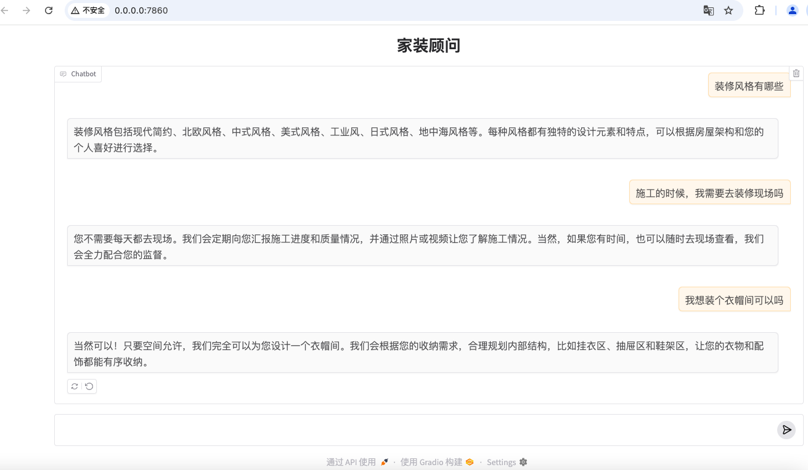

# 家装顾问智能问答系统 🏠

基于 RAG (Retrieval-Augmented Generation) 技术构建的家装领域专业问答助手，结合领域知识库与大语言模型能力，提供装修咨询服务。

## ✨ 核心功能

- 基于知识库内容生成专业回答，拒绝胡编乱造
  
- 提供 Gradio Web 界面交互方式

## 📦 快速开始

### 搭建开发环境

本项目基于python 3.10开发，并使用langchain0.3、gradio 相关技术

完整 python 依赖包见 `requirements.txt` 文件

#### 配置 OpenAI API Key

根据你使用的命令行工具，在 `~/.bashrc` 或 `~/.zshrc` 中配置 `OPENAI_API_KEY` 环境变量：

```shell
export OPENAI_API_KEY="xxxx"
```

#### 克隆仓库
```bash
git clone https://github.com/caile188/sales-robot-rag.git
cd sales-robot-rag
```

#### 安装依赖
```bash
pip install -r requirements.txt
```

#### 运行项目

```bash
python cli.py
```

#### 效果展示



